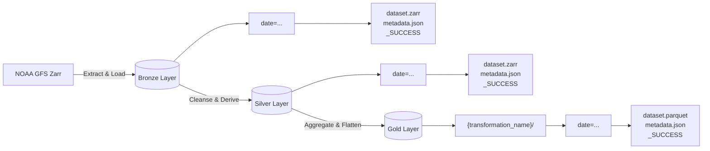

# Global Weather ELT Pipeline (Medallion Architecture)

A production-grade, memory-efficient ELT pipeline that ingests, cleanses, and aggregates global weather data from the **NOAA Global Forecast System (GFS)**.
Built using the **Medallion Architecture** (Bronze $\rightarrow$ Silver $\rightarrow$ Gold) and hosted entirely on a local **MinIO** object storage cluster.

## Architectural Highlights

*   **Stateless Idempotency:** Replaces traditional databases/registries with a **Marker File Pattern** (`_SUCCESS` files). The orchestrator relies purely on the storage layer to determine state, allowing for instant retries and zero wasted compute on re-runs.
*   **Efficient Streaming:** Utilizes **Xarray** and **Dask** to stream multidimensional Zarr arrays directly from remote sources to S3/MinIO without loading massive flatten datasets into RAM.
*   **Quality Gates:** Implements dynamic schema validation and automated null-variable dropping before data is promoted to the Silver layer.
*   **Lineage Tracking:** Every layer generates granular `metadata.json` files tracking execution time, data bounds, mathematical transformations, and upstream parent markers.

## The Medallion Data Flow


## Bronze Layer (Raw)
* **Format:** Multidimensional Zarr
* **Action:** Extracts hourly global weather grids (Temperature, Wind U/V, Precipitation) from `dynamical.org` and streams them to MinIO partitioned by day.
* **Idempotency:** Checks for `bronze/date=YYYY-MM-DD/_SUCCESS`.

## Silver Layer (Cleansed & Conformed)
* **Format:** Multidimensional Zarr
* **Action:**
    1. Passes data through a dynamic quality gates (schema bounds, null percentages, data type,..).
    2. Drops corrupted variables automaticly.
    3. Derives domain-specific metrics: Wind Speed ($\sqrt{u^2+v^2}$) and Meteorological Wind Direction (arctan2).
* **Idempotency:** Checks for `silver/date=YYYY-MM-DD/_SUCCESS`.

## Gold Layer (Aggregations)
* **Format:** Tabular Parquet (Optimized for SQL engines)
* **Actions:**
    * Daily Global Rollup: Aggregates 24 hourly steps into Daily Min/Mean/Max temperatures and wind speeds.
    * Regional Spatial Aggregation: Slices the global grid into bounding boxes (i.e. Europe, North America) and calculates daily regional weather averages.
* Idempotency: Granular markers for each transformation (`hourly_global/_SUCCESS`, `daily_global/_SUCCESS`).

## Tech Stack
* **Languages:** `Python 3.13`
* **Core Data:** `xarray`, `dask`
* **Storage:** `minio-py`, `s3fs`, `fsspec`
* **Orchestration:** Native `concurrent.futures.ThreadPoolExecutor`
* **Infrastructure:** `Docker (MinIO)`

## Project Structure
```text
src/
├── config/                 # Dataclasses for environment variables and settings
├── ingestion/              # Bronze layer extractors for ingestion
├── orchestration/          # The orchestrator (pipeline.py)
├── quality/                # Schema definitions and validation gates
├── storage/                # MinIO client, metadata builders, path builders, and logging handlers
├── transformations/        # Bronze to Silver & Silver to Gold logic
└── utils/                  # Helper functions
```
